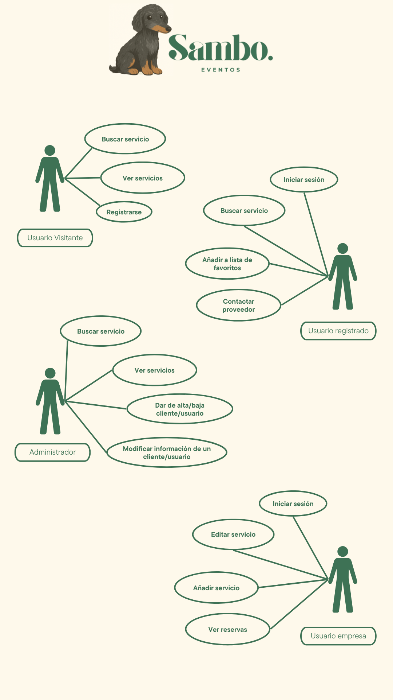

# FASE DE DESEÑO

- [FASE DE DESEÑO](#fase-de-deseño)
  - [1- Diagrama da arquitectura](#1--diagrama-da-arquitectura)
  - [2- Casos de uso](#2--casos-de-uso)
  - [3- Diagrama de Base de Datos](#3--diagrama-de-base-de-datos)
  - [4- Deseño de interface de usuarios](#4--deseño-de-interface-de-usuarios)

## 1- Diagrama da arquitectura

## 2- Casos de uso

## 3- Diagrama de Base de Datos

## 4- Deseño de interface de usuarios

[Figma](https://www.figma.com/design/33aaDwk6hJCFWibN3ECjLV/Sambo?node-id=0-1&t=9BBikmzGAufljyMd-1)

[**<-Anterior**](../../README.md)

